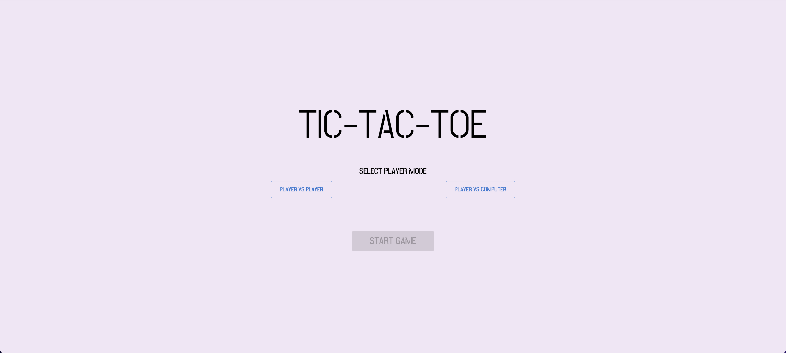
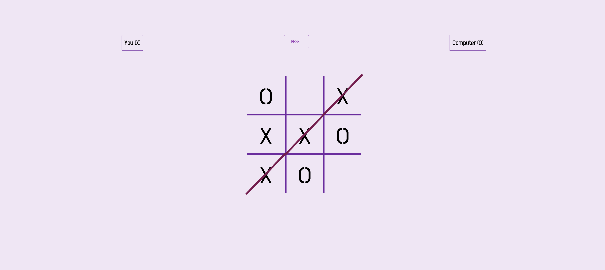

# tic-tac-toe

A tic tac toe web app, [click here](https://laurajhwu.github.io/tic-tac-toe/) to see app

## Tech Highlights

- **Framework**: React.js, TypeScript
- **Build Tool**: Vite, Github Actions (CI/CD for build and deployment)
- **Libraries**: XState, MUI
- Hosted by Github pages

## Web App Features

- Users can select 'Player vs Player' or 'Player vs Computer' modes
- Users can reset game at any point within the game
- Games are kept even after refresh
- Displays all wins on interface if more than one type
